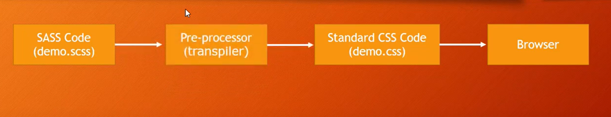
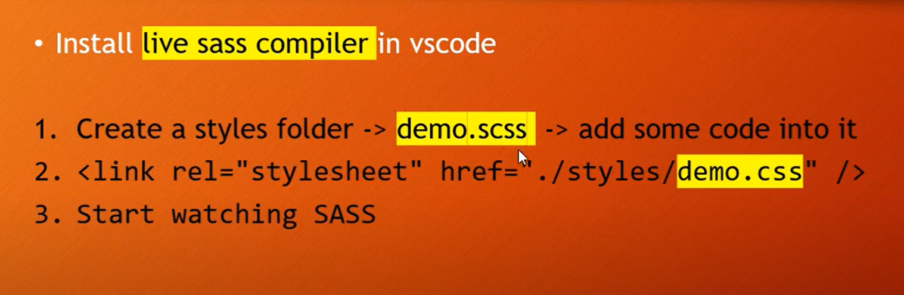

- SASS
    - Syntactically Awesome Style Sheet
    - Extension of CSS


- SASS has some special feature that do not exist in CSS
    - variables
    - nested loops
    - inheritance
    - mmixins,imports

- Don't repeat yourself(reduce code repetation)
- Tools 
    - Install 'Live SASS Compiler'
- How SASS works
    - 

- How to Add SASS in html
    - 

- Modify Default Setting
    - Goto deafult setting then copy follwing code
    ```json
    	"liveSassCompile.settings.formats": [
		{
			"format": "expanded",
			"extensionName": ".css",
			"savePath": null,
			"savePathReplacementPairs": null
		}
	],
    ```
    - After copying paste this code in  user seeting, then saved.

- Partial & Forward
    - We can make partial folder for deafult code for reducing duplicate writing
    - For example we can create base folder then create _reset.scss,_typography.scss,_index.scss
    ```scss
    //Reset code in _reset.scss
    *{
        margin: 0;
        padding: 0;
     }
    ```
    ```scss
    //_typography.scss
    h1,h2,h3,h4{
        margin-top: 0;
        background-color: red;
    }
    ```
    ```scss
    //_index.scss
    //Import all base file
        @forward "reset";
        @forward "typography";
    ```
    - Also _index.scss file need to forward/import into main.scss


- Similarly we can use them as varibles
    - first create _index.scsss
    - _variables.scss
    - Now easily use all varibles but intesd '@forward' use '@use' keyword
- @Mixing for value pass like function
    - ```scss
        @mixin para-style($size ,$style){
            font-size:$size;
            text-align:$style;
        }
      ```
      ```scss
      @include para-style(18px,left);
      ```


- Extend & Inherit(Like OOP)
    - ```scss
        .btn{
            border:none;
            padding:10px;
            margin:10px;
            text-align:center;
        }

        .btn-download{
            @extend .btn;
            //can also add extra feature
            //background-color:red;
            //justify-content:center;
        }
      ```


- If Else If(Like c++)
    - ``` python
        if 
            apply this style
        else if
            apply this style
        else if 
            apply this style
        else 
            apply this style
      ```
    - Example:
      ```scss
      @mixin setFontSize($value){
        @if $value == small{
            font-size:10px;
        }
        @else if $value == medium{
            font-size:14px;
        }
        @else {
            font-size:20px;
        }
      }
      ```

- For Loop and While Loop in SASS
    - Similar to Python for and while loop
    ```sass
    // through or to
    // through 1 to 12
    //to 1 to 11
    @for $i from 1 through 12{
        .col-#{#i}{
            width:100%/12 * i;
        }
    }
    ```
    ```sass
        $i=1;
        @while $i<13{
        .col-#{#i}{
            width:100%/12 * i;
            }
        $i=$i+1;
        }
    ```

- @each keyword(map)
    - 